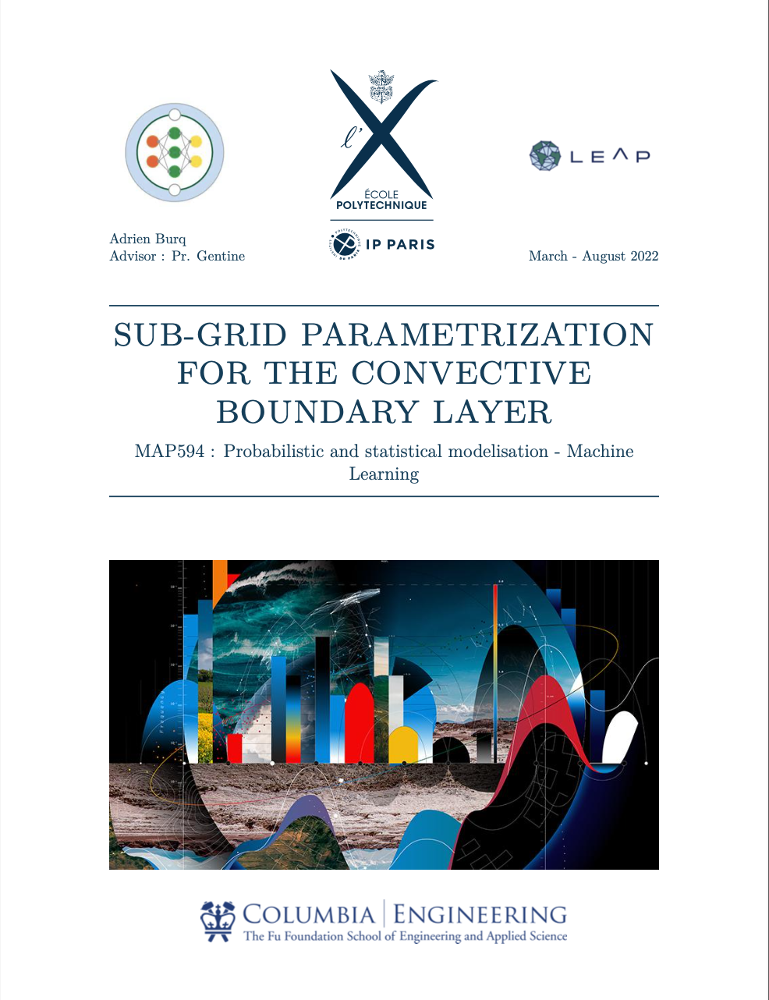

# **Sub-grid parametrization for the convective Boundary Layer**

In this README you can find the research project that I lead in Pr. Gentine's lab at Columbia University in the Earth and Evironmental department.

<br />
<p align="center">
  
</p>
 <br />

Our work here is based on LES simulations. The LES simulations will be used as the ground truth for training different Deep Learning models to parameterize sub-grid scale processes. Since LES simulations (which have a resolution of about 10m) can resolve clouds and convective processes in general, the goal is to use these simulations as ground truth to parameterize lower resolution simulations such as Global Circulation Models that have a resolution of about 10km. There is a huge gap between the resolution of Large-Eddy Simulations and Reynolds Averaged Navier-Stokes based simulations. Therefore, the idea is to bridge this gap by devising a model that can generalize across the different resolution scales. Based on a ground truth of a LES, we aim at a model that can predict accurate sub-grid fluxes on different larger scales.

The first part of the project consisted in getting familiar with the high resolution simulations available, preprocessing the data and designing a predictive model for sub-grid fluxes over and arbitrary resolution scale. The second part of the project was adapting this model so that it could adapt to different resolutions and be accurate on grids with a resolution of 100m as well as on grids with a resolution of 1km.


## **1. Project Structure**

We provide the structure of our project in which you can find usable scripts but also exploration notebooks with comments. The notebook are listed below in the **read order**.

```
.
├── README.md
├── requirements.txt
├── exploration
    ├── free_clustering.ipynb: free administative clustering notebook
    ├── state_clustering.ipynb: state level clustering notebook
    ├── climate_data_clustering.ipynb: extracting climate clusters from Copernicus data

├── data
    ├── merged_data
    ├── external_data
        ├── climate_data: climate data from Copernicus
        ├── maps: maps data to plot our clusters 
        
├── output:
    ├── embeddings: embeddings of our climate clusters and our main crops
    ├── clusters: clusters of our models using our datasets
    ├── plot

├── predictions: containing the submision files
    ├── free: free level clustering predictions 
    ├── state: state level clustering predictions